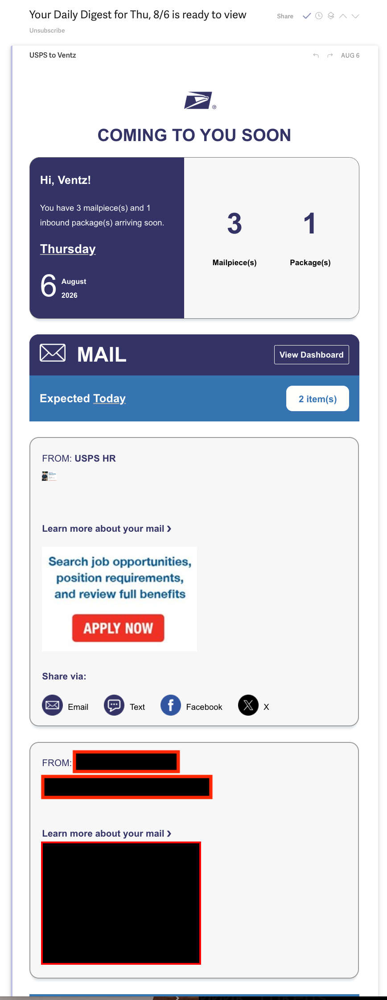
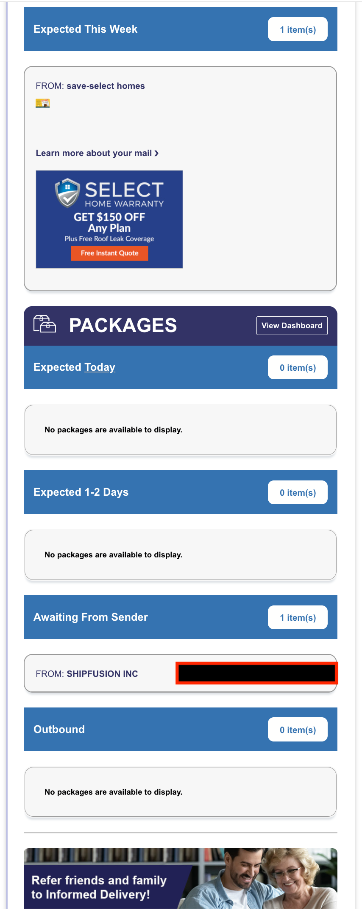
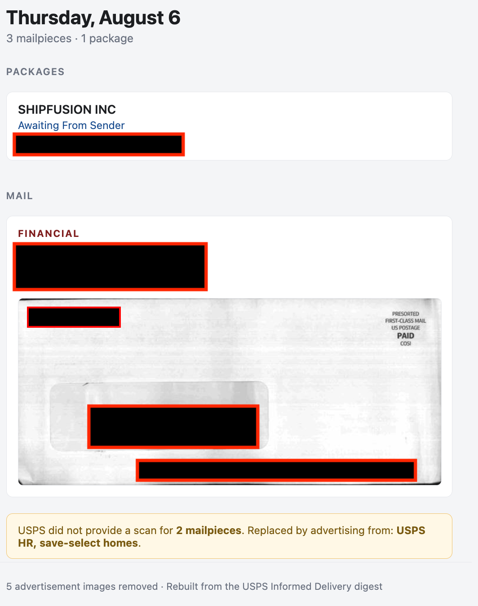
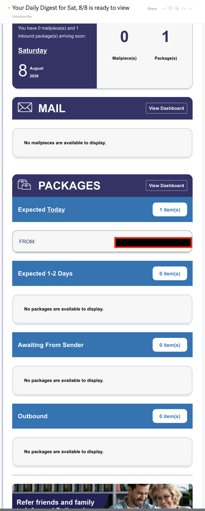
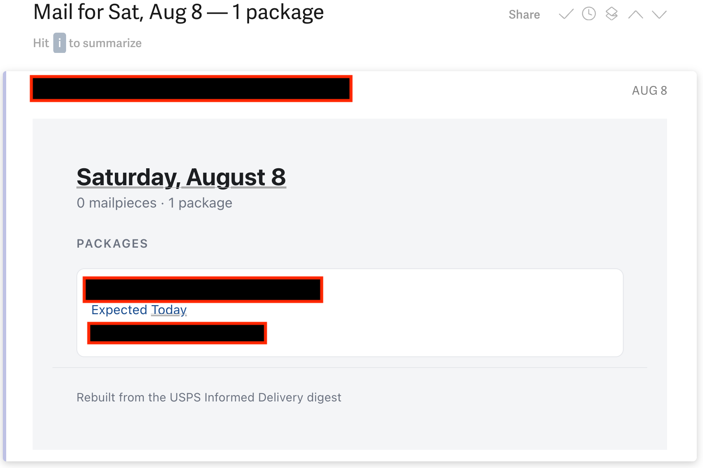
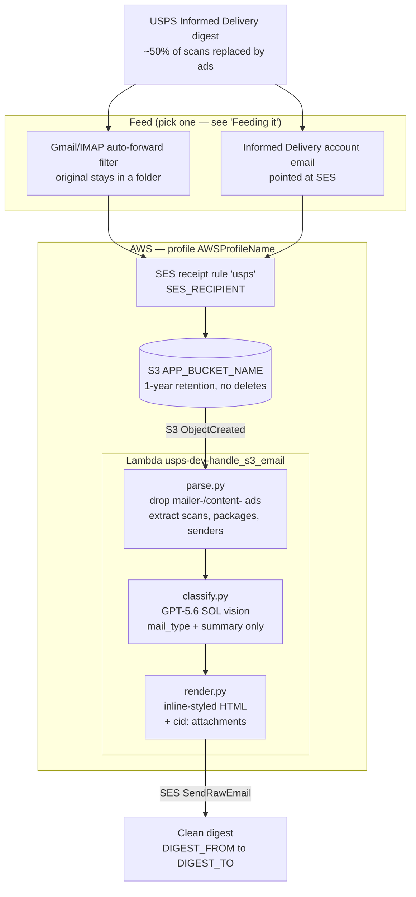

# USPS Informed Delivery Cleaner

Strips the advertising out of USPS Informed Delivery digests and re-sends a clean,
self-contained email showing only your actual mail and packages.

Forward a digest to your SES address (`usps@domainViaSES.tld` — set as `SES_RECIPIENT`
in `.env`); a rebuilt one arrives in your inbox a few seconds later.

---

## Contents

- [Why](#why) — half your mail is replaced by advertising, measured across 19 digests
- [What you get](#what-you-get)
  - [What USPS sends / what you actually wanted](#what-usps-sends--what-you-actually-wanted) — before/after screenshots
- [Architecture](#architecture) — flow diagram, and why there is no web surface
- [Assumptions](#assumptions) — what you need in place (SES for inbound is the hard one)
- [Quick setup](#quick-setup) — ~15 minutes: clone, `.env`, AWS, deploy
- [Development](#development) — local dev loop, free and side-effect-free
- [How the ad-stripping works](#how-the-ad-stripping-works) — the filename deny-list, and two traps
  - [Where the sender comes from](#where-the-sender-comes-from) — markup first, vision as fallback
- [What OpenAI is used for](#what-openai-is-used-for) — exactly what is sent, asked, and not asked
- [Security](#security) — who is allowed to feed the pipeline, and why it matters
- [Stopping the mail itself](#stopping-the-mail-itself) — the one-time checklist, and what can't be stopped
- [Layout](#layout) — file-by-file map
- [AWS](#aws) — resources, deploy, logs
- [Feeding it](#feeding-it) — forward-on-sender, or repoint Informed Delivery
- [Troubleshooting](#troubleshooting)
- [Status](#status)
- [License](#license)

---

## Why

USPS sells the mailpiece slot in Informed Delivery. When an advertiser buys it, their
creative **replaces** the scan of your envelope — you get the ad *instead of* your mail.

Measured across 19 real digests (2026-07-10 → 08-07):

| | |
|---|---|
| Mailpieces announced | 34 |
| Real envelope scans provided | **17** (50%) |
| Advertiser image files | **36** |
| Days with mail but zero scans | 4 |

On 2026-08-05 both mailpieces were sold — a "Daily Digest" containing none of the
recipient's mail.

This rebuilds the digest from only the parts worth keeping.

---

## What you get

- **Packages first** — shipper, status, ETA, tracking number linked to USPS tracking.
- **Mail scans** — each labelled with sender and type (`INSURANCE`, `FINANCIAL`, …) and
  flagged `ACTION NEEDED` when it's a bill, statement, medical, insurance, financial,
  government or legal piece.
- **Honest accounting** — "USPS did not provide a scan for 1 mailpiece. Replaced by
  advertising from: save-select homes." Ad-only days render as a clear statement, not a
  blank page.
- **Zero advertising.** Ads can't leak through: the renderer only emits fields explicitly
  extracted, and a test asserts no dropped filename appears in the outgoing MIME.

### What USPS sends / what you actually wanted

Thursday, Aug 6 — 3 mailpieces announced, 1 real scan, 5 advertiser images. USPS needs two
screens to say that; the rebuild fits one and says plainly what was withheld.

| What USPS sent | What you get |
|---|---|
|   |  |

Saturday, Aug 8 — a no-mail day. USPS still sends a full page of chrome to tell you
nothing came. The rebuild takes three lines.

| What USPS sent | What you get |
|---|---|
|  |  |

(Names, addresses and tracking numbers redacted in black.)

---

## Architecture



Every name in caps is a `.env` key — nothing environment-specific is hardcoded.
See `.env.example`.

**No web surface.** No output bucket, no hosted page, no public URL — this mail is private.
Scans travel as inline `Content-ID` MIME attachments, so the email is self-contained and
Gmail never prompts to load remote images.

---

## Assumptions

This is a personal-scale pipeline, not a product. It assumes:

- **AWS SES for *receiving*, in a region that supports it.** This is the hard requirement —
  inbound is the trigger, not a convenience. SES writes raw MIME to S3, which fires the
  Lambda. SES receiving is region-scoped and not offered everywhere.
- **A domain you control**, verified in SES, with MX pointed at SES for whatever subdomain
  `SES_RECIPIENT` lives on. That address needs no mailbox — SES writes raw MIME to S3.
- **SES production access** to send anywhere; in the sandbox, verify `DIGEST_TO` first.
- **An OpenAI API key.** Each kept scan — your name and address included — is uploaded for
  classification. See [What OpenAI is used for](#what-openai-is-used-for).
- **A USPS Informed Delivery account**, and a way to forward its digests in — see
  [Feeding it](#feeding-it).
- **Python 3.13 and `uv`**, the only dependency source of truth.

**On other providers:** the *sending* half is replaceable — Resend, Postmark and Mailgun all do
it well, and Resend supports the inline `cid:` images this digest needs. Expect a rewrite, not
a re-point: `render.py` assembles raw MIME for `SendRawEmail`, while Resend takes JSON. The
*receiving* half is different — **Resend is send-only, with no inbound product**, so it cannot
start this pipeline. A substitute must accept mail for your domain and hand you the raw
message: SES, a Cloudflare Email Worker, Mailgun inbound routes, or your own SMTP server.

---

## Quick setup

Roughly 15 minutes, most of it on the AWS side. See [Assumptions](#assumptions) for what you
need in place first.

**1. Clone and install**

```bash
git clone <your-fork> usps-informed-delivery-no-ads
cd usps-informed-delivery-no-ads
uv sync
```

**2. Fill in `.env`**

`.env.example` is the complete list of settings — copy it and edit. Nothing is hardcoded
in the code, so this file is the only place your real addresses, bucket and AWS profile
ever appear (and it is gitignored):

```bash
cp .env.example .env
```

| Key | Example | What it is |
|---|---|---|
| `AWS_PROFILE` | `AWSProfileName` | Local AWS credentials profile |
| `AWS_REGION` | `us-east-1` | SES *receiving* is region-scoped — pick a region that supports it |
| `AWS_ACCOUNT_ID` | `123456789012` | Only used to name the bucket |
| `SES_RECIPIENT` | `usps@domainViaSES.tld` | Address you forward digests to |
| `APP_BUCKET_NAME` | `usps-ai-email-123456789012` | Raw inbound email, 1-year expiry |
| `DIGEST_FROM` | `no-reply@domainViaSES.tld` | Verified SES sender |
| `DIGEST_TO` | `you@yourmail.tld` | Where the clean digest lands |
| `ALLOWED_FORWARDERS` | *(defaults to `DIGEST_TO`)* | Who may forward digests in — see [Security](#security) |
| `OPENAI_API_KEY` | `sk-proj-…` | Vision classification |
| `OPENAI_MODEL` | `gpt-5.6-sol` | Any vision-capable model |

**3. Create the AWS side**

- Verify your domain in SES (plus `DIGEST_TO` as an identity, if you're still in the sandbox).
- Create the S3 bucket (`APP_BUCKET_NAME`) with a 1-year expiry lifecycle rule.
- Add an SES **receipt rule** for `SES_RECIPIENT` with an S3 action writing to that bucket.

**4. Give Lambda the same settings**

```bash
cp .chalice/config.json.example .chalice/config.json   # then fill in the same values
```

The Lambda reads settings from here, not `.env` — so add `ALLOWED_FORWARDERS` too if you set
it. It is absent from the example on purpose: JSON takes no comments, and a placeholder
copied verbatim would reject every real digest. Omitting it applies the `DIGEST_TO` default.

**5. Deploy and try it**

```bash
./tools/deploy.sh          # exports requirements.txt from uv.lock, deploys, cleans up
```

Forward one Informed Delivery digest to `SES_RECIPIENT`. A rebuilt copy should reach
`DIGEST_TO` within about 15 seconds. Then set up the [automatic feed](#feeding-it).

---

## Development

```bash
uv run tools/make_fixture.py                  # build synthetic .eml fixtures
uv run tools/test_local.py --all              # parse + render (no API calls, no sending)
uv run pytest tests/ -q
```

Against real mail (all scripts read `.env`, so no inline profile is needed):

```bash
uv run tools/inspect_email.py                        # dump MIME of newest S3 object
uv run tools/test_local.py --s3-key <key> --vision
uv run tools/test_local.py --s3-key <key> --vision --send
```

Vision (`--vision`) and sending (`--send`) are **off by default** — the dev loop costs
nothing and has no side effects.

---

## How the ad-stripping works

Attachment filenames split cleanly, so removing ads is a **deny-list, not a judgment call**:

| Pattern | What it is | Action |
|---|---|---|
| `<serial>-0NN.jpg` | real envelope scan | **keep** |
| `mailer-<campaignid>.jpg` | advertiser's stylized replacement for the mailpiece | drop |
| `content-<campaignid>.jpg` | ride-along banner ad | drop |

Two traps worth knowing:

- **Never key on `-068`.** The suffix varies (`-066`, `-067`, `-058`). Deny-list the two ad
  prefixes and keep everything else.
- **`content-` can appear with no `mailer-` partner.** That's the signature of a campaign
  that supplied no replacement image — meaning the *real* scan survived. A good sign.

### Where the sender comes from

Preferred: **parsed from the markup.** USPS gives each mailpiece its own block, and a
campaign block states its sender in a `FROM:` heading, so `parse.map_cid_senders()` maps
each image to the sender of *its own* block deterministically. A plain mailpiece block
has no `FROM:` — it gets no parsed sender rather than borrowing a neighbour's.

Fallback: **vision**, for pieces with no `FROM:` label — where the sender exists only
inside the JPEG (e.g. an insurer's envelope on 2026-08-07).

This ordering matters. Asking the model for a sender the email already states produced
unstable output — identical input returned the company name on one run and a bare PO Box
on the next. General rule for this codebase: **ask the model only what the email doesn't
already say.** `actionable` is likewise derived from `mail_type`, never model-supplied.

---

## What OpenAI is used for

One call per **kept** envelope scan (`chalicelib/classify.py`), via the Responses API with
an `input_image` part — the model is whatever `OPENAI_MODEL` names (default `gpt-5.6-sol`).
Ad images are dropped before this step, so advertiser creative is never sent.

**What it is asked for**

| Field | Why the model |
|---|---|
| `mail_type` | `bill`, `statement`, `insurance`, `credit_offer`, `political`, `catalog`, `junk`, … Nothing in the digest states this; it's only inferable from the envelope. |
| `summary` | One line of "what is this piece", for the card under the scan. |
| `recipient` | Who in the household it's addressed to — printed on the envelope, nowhere in the email text. |
| `sender` | **Fallback only.** Used when the digest has no `FROM:` label for the piece, so the sender exists solely inside the JPEG. |
| `sender_source` | `return_address` / `logo` / `candidate_match` / `address_only`. Not displayed — it exists to force the model to state *how* it got the sender, which stops it silently ignoring the candidate list. |

**What it is deliberately NOT asked for**

- `sender` when the markup already states it — the parsed `FROM:` heading always wins.
- `actionable` — derived from `mail_type` via `ACTIONABLE_TYPES`. As a model field it
  flipped True/False on identical input.
- Anything about the ads. Ad-stripping is a filename deny-list, not a judgment call, so no
  LLM decides what counts as advertising.
- Account numbers, amounts, or anything not plainly visible — the prompt says to answer
  `Unknown` rather than guess.

Grounding, not recall: `classify_all()` passes the digest's own `FROM:` names in as
*candidate* senders, so an anonymous PO-Box envelope can be resolved from evidence in the
same email. The prompt explicitly says to ignore the list when nothing matches.

**Privacy.** This is the one place data leaves your account: each kept scan — an image of
the outside of your envelope, including your name and address — is uploaded to OpenAI. If
that's not acceptable, leave `OPENAI_API_KEY` unset; `classify.py` never raises, so the
digest still renders with parsed senders, packages, and the ad accounting, just without
mail-type labels. `--vision` is off by default in the local dev loop for the same reason.
Failures are non-fatal by design: a classification error degrades one card, it does not
lose the digest.

---

## Security

`SES_RECIPIENT` is an address, and addresses leak. Anyone who learns yours can drop a message
into your bucket and have it mailed onward from `DIGEST_FROM` — a sender you trust, arriving
unattended, looking like every other digest. Escaping handles HTML and header injection, but
nothing stops a forged sender name printed across an attacker-supplied image. So the pipeline
checks *who forwarded it* before parsing anything.

Three gates run in `app._accept`: a 15 MB size cap (before parsing, so a hostile body can't
OOM the function), the SES spam and virus verdicts, and the forwarder allow-list. All fail
**closed** — a missing verdict header or absent `Return-Path` is a rejection. Nothing outside
the Lambda calls this gate, so no local path needs the leniency.

**`ALLOWED_FORWARDERS` defaults to `DIGEST_TO`** — correct when you forward from the same
mailbox the digest returns to. Set it when the forwarding address differs, but note an
explicit list **replaces** the default rather than extending it, so include `DIGEST_TO`
yourself if you also forward by hand. Entries are comma-separated and case-insensitive;
each is a full address (matched exactly) or a bare `@customdomain.tld`
(the domain and its subdomains — *not* a substring, so it will not accept
`attacker@customdomain.tld.evil.example`):

```
ALLOWED_FORWARDERS=youremail@gmail.com,@customdomain.tld
```

> **Gmail's auto-forward does not send as your own address.** It rewrites the envelope sender
> to `youremail+caf_=usps=domainviases.tld@customdomain.tld`, so an allow-list holding only
> your plain address would reject every auto-forwarded digest — silently, since a rejection
> is a log line, not a bounce. The `+tag` is stripped before matching, so one entry covers
> both hand- and auto-forwarded mail.

A lone `ALLOWED_FORWARDERS=*` disables the check entirely. Anything else that resolves to no
usable entry — a blank value, stray commas, `*` mixed with real entries — is a hard startup
error rather than a silent disable, because turning the gate off should be deliberate.

**Be clear about what this gate is and isn't.** It matches `Return-Path` — the SMTP envelope
sender, which is *asserted* by whoever connects, not verified. So the allow-list raises the
bar (an attacker must also learn `SES_RECIPIENT`) but it does **not** authenticate. Treat it
as one layer, not as proof of origin.

Real authentication is available and **this project does not yet use it**. SES stamps an
`Authentication-Results` header under its own `amazonses.com` authserv-id carrying `spf=`,
`dkim=` and `dmarc=` results, and because SES prepends its trace headers, a forged copy in
the message body sits below it and is never read. Two options, neither implemented:

| | **C — require `spf=pass`** | **D — require USPS `dkim=pass`** |
|---|---|---|
| Proves | The **forwarder** was authorised by the domain it claimed | The digest genuinely came from **USPS**, cryptographically |
| Strength | Closes the forgery path | Stronger — forging needs USPS's private key |
| Cost | SPF binds a *domain*, not a mailbox | **Rejects hand-forwarded mail** — a Forward button rewrites the body and breaks the signature |
| Works with | Both forwarding styles | Auto-forward only; needs an escape hatch for manual tests |

Either should run **log-only first** — record the verdict, change nothing, watch for a
`WOULD-REJECT` line — and then fail closed once you trust it.

See **[docs/authenticating-the-sender.md](docs/authenticating-the-sender.md)** for the full
comparison, the header format, and the measurements behind this.

---

## Stopping the mail itself

This project makes the digest readable. It does not stop the mail — but almost all
of that is a one-time job, and it's written up here:

**→ [How to stop physical junk mail](docs/stopping-junk-mail.md)**

An afternoon of work removes most of it permanently: prescreened credit and
insurance offers (free, federally mandated), broad prospect mail (DMAchoice, $8 /
10 years), the shared-mail envelopes, catalogs, and the one data broker that still
runs a real postal opt-out. The doc is written to be printed, with blanks for the
renewal dates — they expire, and moving house silently undoes them.

It also covers what *cannot* be stopped, including Informed Delivery's own
advertiser campaigns. USPS offers no setting for those, which is why this project
exists.

> A per-mailpiece "opt out" link was built and then deliberately removed. Once the
> one-time steps are done, roughly one mailpiece a month has a company-specific
> opt-out that is both discoverable and useful — and of eight large mailers checked,
> only two offered a web page at all; the rest were phone, email, or nothing. A
> curated URL registry cost more to maintain than it returned, and could not detect
> a link that still resolved but had quietly stopped being an opt-out page.

---

## Layout

| Path | Purpose |
|---|---|
| `app.py` | Chalice Lambda; `process_raw_email()` is the whole pipeline |
| `chalicelib/config.py` | Env-first config; loads `.env`, fails loudly if a key is missing |
| `chalicelib/parse.py` | MIME → `Digest`; ad filter; sender mapping |
| `chalicelib/classify.py` | GPT-5.6 SOL vision → `Classification` |
| `chalicelib/render.py` | `Digest` → HTML + MIME assembly |
| `tests/` | Regression tests pinned to the real corpus |
| `tools/` | Dev + ops scripts: fixtures, local runs, S3 inspection, deploy |
| `docs/` | [Stopping junk mail](docs/stopping-junk-mail.md) · [Authenticating the sender](docs/authenticating-the-sender.md) |

---

## AWS

All values come from `.env` (see [Quick setup](#quick-setup)); Lambda gets the same keys
from `.chalice/config.json`. Both files are gitignored — `.env.example` and
`.chalice/config.json.example` are the templates.

| Resource | Name |
|---|---|
| SES receipt rule | `usps` in rule set `RECEIVE` → `SES_RECIPIENT` |
| Input bucket | `APP_BUCKET_NAME` (1-year expiry) |
| Lambda | `usps-dev-handle_s3_email` (512 MB, 300 s) |
| Sender / recipient | `DIGEST_FROM` → `DIGEST_TO` |

Deploy:

```bash
./tools/deploy.sh                            # AWS_PROFILE comes from .env
```

**uv is the single source of truth for dependencies.** Chalice only knows how to read
`requirements.txt`, so `tools/deploy.sh` exports one from `uv.lock` (`uv export --no-dev`),
deploys, and deletes it — the file is generated and gitignored, never edited by hand.
`boto3` is a dev-only dep because the Lambda runtime already provides it. Chalice also
imports `app.py` locally to introspect it, which is the other reason `uv sync` runs first.

Logs:

```bash
aws --profile "$AWS_PROFILE" logs tail /aws/lambda/usps-dev-handle_s3_email --since 10m
```

Raw emails are deliberately **not** deleted after processing — they expire on the 1-year
lifecycle rule and serve as the regression corpus.

---

## Feeding it

Two ways to get digests into the pipeline. Both need the same one-time trick for the
confirmation email, because `SES_RECIPIENT` has no mailbox — SES writes raw MIME straight
to S3. Run this, then trigger the verification, and it prints the code or click-link:

```bash
uv run tools/catch_verification.py --watch
```

**1. Forward from your mail provider (recommended to start).**
Add a filter on the sender `@email.informeddelivery.usps.com` that forwards to
`SES_RECIPIENT`. You still receive the original — file it into a folder "just in case" —
and read only the transformed one. Nothing breaks if the pipeline does. Add the forwarding
account to [`ALLOWED_FORWARDERS`](#security) when it isn't `DIGEST_TO`, or the gate will
drop every auto-forwarded digest.

**2. Change the address at USPS (long-term, once you trust it).**
Point your Informed Delivery account email at `SES_RECIPIENT` directly. USPS sends to one
address only, so this replaces the original delivery entirely — hence "once you're
comfortable". Catch the USPS confirmation with the command above, approve it, and every
digest flows through automatically from then on.

---

## Troubleshooting

| Symptom | Cause |
|---|---|
| Forwarded mail never appears in S3 | Usually just latency (~15 s). Verify the `usps` rule is enabled and no earlier rule has a `StopAction`. |
| `Missing required config: ...` | `.env` not filled in — copy `.env.example`. |
| `ModuleNotFoundError: bs4` on deploy | Local venv not synced — run `uv sync`. |
| Mail lands in S3 but no digest arrives | Check the logs for `rejecting: unrecognised forwarder` — see [Security](#security). Gmail auto-forward sends as `you+caf_=…`, not as your plain address. |
| Digest renders with no mail | Likely correct: an ad-only day. Check the "did not provide a scan" notice. |
| Sender shows a bare PO Box | Piece had no `FROM:` label and the envelope is anonymous. Expected. |
| Mojibake in the email | HTML needs `<meta charset="utf-8">` and the MIME part an explicit utf-8 charset. |

---

## Status

Live since 2026-08-07, running without issues. Every digest forwarded since then has come
back clean, unattended — including the awkward cases: an ad-only day with zero real scans,
a piece whose sender was only in the markup, and one whose sender existed only inside the
scanned envelope.

Next up: push notifications when `ACTION NEEDED` mail arrives.

## License

MIT — see [LICENSE](LICENSE).
